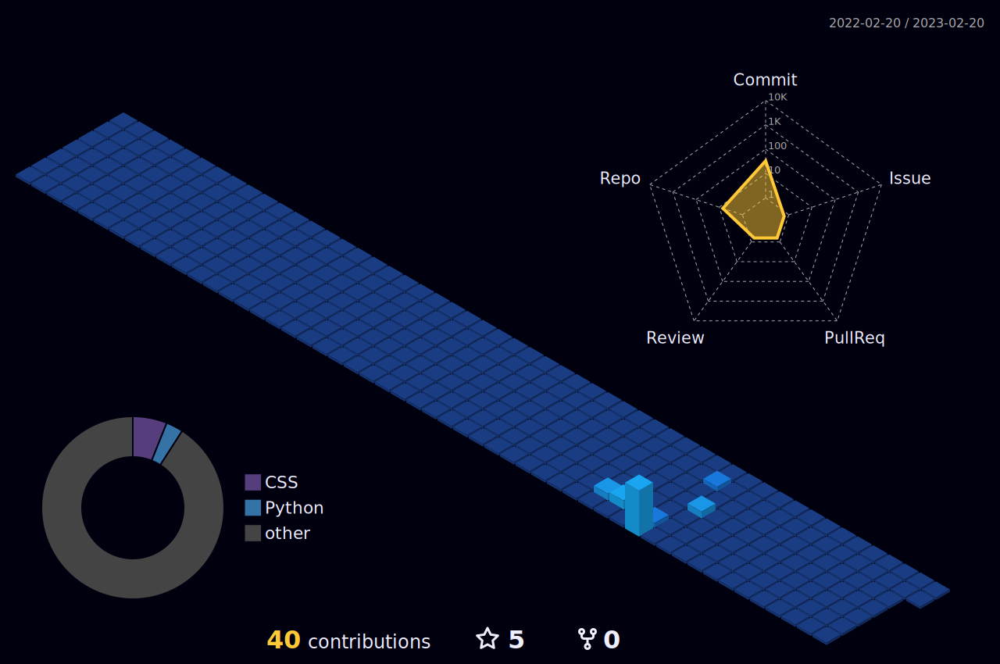

<h1 align="center">
  
</h1>

<h3 align="center">Computer Engineering Student At Duoc UC
</h3>

-I’m currently learning Java and also some of SQL. 😉
  

-Stay Tunned! 😄
  

 
  
## Things I'm into:

  

    
  

## My activity:

<!--
**Venec0/Venec0** is a ✨ _special_ ✨ repository because its `README.md` (this file) appears on your GitHub profile.

Here are some ideas to get you started:

- 🔭 I’m currently working on ...
- 🌱 I’m currently learning ...
- 👯 I’m looking to collaborate on ...
- 🤔 I’m looking for help with ...
- 💬 Ask me about ...
- 📫 How to reach me: ...
- 😄 Pronouns: ...
- ⚡ Fun fact: ...
-->
